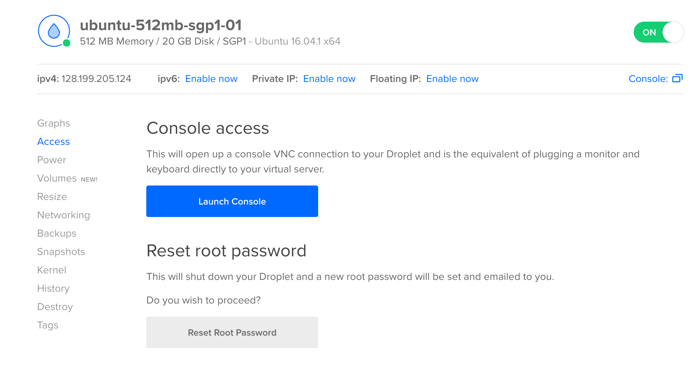

# Ryukyu Social Server Setup

This tutorial assumes you have a Linux server (Ubuntu perferred).

## Basic server setup

The first thing you need to do is set bare minimum settings for server security.  Here I will summarize quickly.  The original tutorial is here: [https://www.digitalocean.com/community/tutorials/initial-server-setup-with-ubuntu-16-04](https://www.digitalocean.com/community/tutorials/initial-server-setup-with-ubuntu-16-04)

### Log in as Root

1. **Remotely log into the server with username "root" and root password.**  To do this, type the following on the command line (use Terminal program on your Macbook).  You should get prompts to enter the password.
```
ssh root@server_ip_address
```
(optional) If you forgot your root password, you can reset it by logging into your Digital Ocean account, selecting your droplet, select "access", and reset root password.


### Create a new user

1. You should now be logged into your server.  Everything you type now is executing on your remote server.  **Create a new user for your server.**  In the future, you do not want to log in as "root", it is not good practice to use the "root" account.  Choose a username, for example "riv".  Type in a good password, and accept all defaults by pressing "Enter".
```
adduser riv
```

### Root Privileges

1. **This new user will be the server admin.**  Give your new user sudo privileges for performing administrative tasks.
```
usermod -aG sudo riv
```

### Add Public Key Authentication (Optional but recommended)

1. **We will now setup so we can log into the server with ssh-keys instead of using a password.**  It is insecure to use a password to log into your server because if anyone finds out your password, anyone can log into your server from anywhere in the world. Check if you already have a local ssh-key on your local computer (Macbook).  Start a new Terminal and type the following on the command line:
```
ls ~/.ssh
```
If you see "id_rsa" and "id_rsa.pub" it means you already have an ssh-key, you may skip step 5.  If you do not, then you don't have one yet, follow step 5.

2. **Create an ssh-key on your local computer.**  Start a new Terminal and type and execute the following on your local machine.  Accept all defaults by pressing enter.  You do not need to enter a passphrase, leave empty and hit enter.
```
ssh-keygen
```

3. **Copy your local ssh-key to your clipboard** so that you can add it to your server.  To do this first type:
```
cat ~/.ssh/id_rsa.pub
```

Then select the output and copy it to your clipboard.  For example you will see:
```
id_rsa.pub contents
ssh-rsa AAAAB3NzaC1yc2EAAAADAQABAAABAQDBGTO0tsVejssuaYR5R3Y/i73SppJAhme1dH7W2c47d4gOqB4izP0+fRLfvbz/tnXFz4iOP/H6eCV05hqUhF+KYRxt9Y8tVMrpDZR2l75o6+xSbUOMu6xN+uVF0T9XzKcxmzTmnV7Na5up3QM3DoSRYX/EP3utr2+zAqpJIfKPLdA74w7g56oYWI9blpnpzxkEd3edVJOivUkpZ4JoenWManvIaSdMTJXMy3MtlQhva+j9CgguyVbUkdzK9KKEuah+pFZvaugtebsU+bllPTB0nlXGIJk98Ie9ZtxuY3nCKneB+KjKiXrAvXUPCI9mWkYS/1rggpFmu3HbXBnWSUdf localuser@machine.local
```
4. **We will now add your ssh-key to the server.** Go back to the terminal where you are logged into your server. First, switch to your "riv" user account
```
su - riv
```

5.  You will now be in the home directory for "riv" user.  Make a .ssh folder and set permissions for it.
```
mkdir ~/.ssh
chmod 700 ~/.ssh
```

6.  **Create "authorized_keys" file**.  Use "vim" or "nano" to create the file.  For example with nano:
```
nano ~/.ssh/authorized_keys
```
Save and exit by typing "CTRL X", press "y" then "Enter".

7. Set permissions for the new file:
```
chmod 600 ~/.ssh/authorized_keys
```
8. Switch back to the "root" user by typing:
```
exit
```

9. Repeat steps 1-8 for other computers that you wish to allow access to the server.

### Disable Password Authentication (Optional but recommended)

1.  **We will now disable password log in** so that users can only log into the server if they have a ssh-key pair that matches with the server. (done in the previous step).  To do this first open the following file with vim or nano (make sure you are logged into your server as "root"):
```
sudo nano /etc/ssh/sshd_config
```

2. Find the following line and set it to "no"
```
PasswordAuthentication no
```

3. Save and exit the text editor.  If you are using nano, save and exit by typing "CTRL X", "y", then "Enter".

4. Restart the ssh daemon:
```
sudo systemctl reload sshd
```
### Test remote log in with "riv" 
1. In case this step does not work, do not exit terminal that is logged in with "root".  
2. Start a new terminal and type the following:
```
ssh riv@server_ip_address
```
3. If everything is right, you should now be logged into your server as user "riv".  You may now exit the terminal that was logged in as "root".

### Set up basic Firewall

1.  We will want to start a firewall to block all ports, and open only the ports that we need.  We can list the current ports that the fire wall allows by typing the following:
```
sudo ufw app list
```
2.  If it is not already in the list, we want to open "SSH" port so that we can log into our server with ssh as before.  Type the following:
```
sudo ufw allow OpenSSH
```
3. Now enable the firewall:
```
sudo ufw enable
```
4. View the status of the firewall by typing the following:
```
sudo ufw status
```

## Firewall Setup for Ryukyu Social
Below is a quick summary of firewall settings for our server.  For detailed information on how to setup the firewall visit [https://www.digitalocean.com/community/tutorials/ufw-essentials-common-firewall-rules-and-commands](https://www.digitalocean.com/community/tutorials/ufw-essentials-common-firewall-rules-and-commands)

1. Allow **http** and **https** connections to our server.
```
sudo ufw allow http
```
```
sudo ufw allow https
```
2. View the firewall status. That is it, we do not wish to allow any other kinds of connections to our Ryukyu Social server.
```
sudo ufw status
```

## Setup Swap Memory
Ryukyu Social uses more than 512mb of ram.  This could be a problem if our server only has 512mb of ram, the app will crash.  In order to get around this, we can add "virtual" ram, AKA swap memory.  What we are doing is setting up our server to use our hard-disk memory (as virtual ram) when it runs out of actual ram memory.  Virtual RAM is a lot slower than actual RAM (because we are using the hard-disk), however the advantage is our application will not crash if it runs out of actual RAM.  The original tutorial can be found here: [https://www.digitalocean.com/community/tutorials/how-to-add-swap-space-on-ubuntu-16-04](https://www.digitalocean.com/community/tutorials/how-to-add-swap-space-on-ubuntu-16-04)

### Check the system for swap information
1. Check if your server already has swap memory setup. If there is no output, it means there is no swap memory.
```
sudo swapon --show
```
2. Verify there is no active swap with:
```
free -h
```
```
Output
              total        used        free      shared  buff/cache   available
Mem:           488M         36M        104M        652K        348M        426M
Swap:            0B          0B          0B
```
### Check available space on your hard-drive
1. Check how much space you currently have on your hard-disk:
```
df -h
```
```
Output
Filesystem      Size  Used Avail Use% Mounted on
udev            238M     0  238M   0% /dev
tmpfs            49M  624K   49M   2% /run
**/dev/vda1        20G  1.1G   18G   6% /**
tmpfs           245M     0  245M   0% /dev/shm
tmpfs           5.0M     0  5.0M   0% /run/lock
tmpfs           245M     0  245M   0% /sys/fs/cgroup
tmpfs            49M     0   49M   0% /run/user/1001
```
Above shows we are only using 1.1G of 20G.  Generally we want to add 1 to 2 times our RAM size for swap memory.  For example for a 512mb server, we may create 1G of swap memory.

### Create Swap File
1. Create 1G of swap memory (for a 512mb RAM server).  For any other server, just use double the amount of your RAM.
```
sudo fallocate -l 1G /swapfile
```

2. Verify the correct amount was reserved: 
```
ls -lh /swapfile
```
### Enable Swap File
1. Set permissions for the file:
```
sudo chmod 600 /swapfile
```
2. Mark the file as swap space:
```
sudo mkswap /swapfile
```
3. Enable the swap file:
```
sudo swapon /swapfile
```
4. Verify the swap available:
```
sudo swapon --show
```
5. We can also verify with:
```
free -h
```
### Make the swap file permanent
We need to setup so that when we reboot the server, the swap file remains set properly.
1. Backup current fstab file
```
sudo cp /etc/fstab /etc/fstab.bak
```
2. Add swap file information to fstab file
```
echo '/swapfile none swap sw 0 0' | sudo tee -a /etc/fstab
```
Now whenever the server reboots, it will read the fstab file and start the swap properly.
### Tweak Swap File Settings
We want to tweak some swap parameters, more information about it can be seen in the original tutorial link.
1. Set the "swappiness" of the swap
```
sudo sysctl vm.swappiness=10
```
2. Make it permanent by adding to /etc/sysctl.conf.  Open /etc/systcl.conf with text editor and add the following to the bottom:
```
vm.swappiness=10
```
3. Adjust "cache pressure" setting:
```
sudo sysctl vm.vfs_cache_pressure=50
```
4. Add the following line to the end of /etc/sysctl.conf.
```
vm.vfs_cache_pressure=50
```
5. Save and exit.  We are now done, your server is setup to have 1G swap memory.

## Domain Name Setup
We now want to set up our server to have a domain name.  To do this, we first have to have a domain name registered.  For example, you can buy domain names at "GoDaddy.com".  For Ryukyu Social, we must have a domain name setup for our server because it uses subdomains.  

1. Follow the original tutorial here to setup your domain name: [https://www.digitalocean.com/community/tutorials/how-to-set-up-a-host-name-with-digitalocean](https://www.digitalocean.com/community/tutorials/how-to-set-up-a-host-name-with-digitalocean)

## Install NGINX, MySQL, NodeJS, and PM2
Ryukyu Social uses NodeJS and MySQL for it's backend.  We will use PM2 to manage our NodeJS instances.  Finally, we will use NGINX as a proxy server to forward http requests to our backend NodeJS applications.  Follow the following tutorials to install these applications appropriately.
1. Install NGINX: [https://www.digitalocean.com/community/tutorials/how-to-install-nginx-on-ubuntu-16-04](https://www.digitalocean.com/community/tutorials/how-to-install-nginx-on-ubuntu-16-04)
2. Install MySQL: [https://www.digitalocean.com/community/tutorials/how-to-install-mysql-on-ubuntu-16-04](https://www.digitalocean.com/community/tutorials/how-to-install-mysql-on-ubuntu-16-04)
3. Install NodeJS and PM2: [https://www.digitalocean.com/community/tutorials/how-to-set-up-a-node-js-application-for-production-on-ubuntu-16-04](https://www.digitalocean.com/community/tutorials/how-to-set-up-a-node-js-application-for-production-on-ubuntu-16-04)

## Configure MySQL to be able to use Japanese characters
To allow MySQL to use Japanese characters, perform the following.  Original information found here: [https://stackoverflow.com/questions/3513773/change-mysql-default-character-set-to-utf-8-in-my-cnf](https://stackoverflow.com/questions/3513773/change-mysql-default-character-set-to-utf-8-in-my-cnf)

1. Open /etc/mysql/my.cnf and make sure it has the following:
```
[mysqld]
bind-address=0.0.0.0

[client]
default-character-set=utf8

[mysql]
default-character-set=utf8


[mysqld]
collation-server = utf8_unicode_ci
init-connect='SET NAMES utf8'
character-set-server = utf8

!includedir /etc/mysql/conf.d/
!includedir /etc/mysql/mysql.conf.d/
```

2. Restart mysql:
```
sudo /etc/init.d/mysql stop
sudo /etc/init.d/mysql start
```
## Install Git on the server
You will need Git to download Ryukyu Social source code.  Log onto your server and type the following:
```
sudo apt-get update
sudo apt-get install git
```

## Install Code Checker on the server
Ryukyu Social has code checker integration.  In order to use code checker, it must be installed on the server.

1. Log onto your server and install code checker by following instructions at: [https://github.com/riv-dev/code_checker](https://github.com/riv-dev/code_checker)

## Download Ryukyu Social Source Code
Ryukyu Social uses a "master" and "stable" branch workflow.  The source code has a master branch, and a stable branch.  The master branch is used for continuous integration and testing of new features.  The master branch could be thought of as the "staging" branch where we stage our developmental changes before we release it into production.  Once we are happy of the state of our master branch (all code is working properly), we pull the master branch code into the stable branch.  Production is always running code from the stable branch only.  You can read more about this workflow here [https://gist.github.com/digitaljhelms/4287848](https://gist.github.com/digitaljhelms/4287848)

### Clone and setup Ryukyu Social backend code

1. Log onto your server.  In your home directory (for example "riv"), create a folder called "backend".
```
cd ~/
mkdir backend
```
2. Go into your backend directory and clone the "master" branch of Ryukyu Social from GitHub.
```
cd backend
git clone https://github.com/riv-dev/ryukyu_social_backend.git
```
3. Change the name of the folder to "ryukyu_social_backend_dev". This will be the backend used for staging and testing our developmental changes.
```
mv ryukyu_social_backend ryukyu_social_backend_dev
```
4. Now, clone the "stable" branch.  Again make sure you are in the "backend" directory.
```
git clone -b stable https://github.com/riv-dev/ryukyu_social_backend.git
```
5. Change the name of the folder to "ryukyu_social_backend_prod".  This will be the production backend, the actual backend the users will use.
```
mv ryukyu_social_backend ryukyu_social_backend_prod
```

### Setup credentials.js file
We will setup one credentials.js file, and create a symbolic link for each microservice.  This way if our credentials changes, we only have to change one file, instead of changing many.
1. Change into the ryukyu_social_backend_dev directory and copy credentials.example.js from the tasks service into the ryukyu_social_backend_dev directory
```
cd ryukyu_social_backend_dev
cp tasks/credentials.example.js credentials.js
```
2. Open credentials.js and edit the following.  When done save and exit the text editor.
```
module.exports = {
    mysql: {
        development: {
                host     : '<change to your server's IP address>',
                username     : '<change to your MySQL username>',
                password : '<change to your MySQL password>'
        },
        production: {
                host     : '<change to your server's IP address>',
                username     : '<change to your MySQL username>',
                password : '<change to your MySQL password>'
        }
    },
    authentication: {
        secret: '<choose a random string of letters and numbers e.g. ad80fjadf023dg9aae8382>',
        development_token: "",
        encryption_pw: "<choose a random string of letters and numbers e.g. afdjahfda2930329adaf>"
    }
}
```
3.  Now we want to create a symbolic link for credentials.js in each of our microservices.  We will do "user_management" service as an example.
```
cd user_management
ln -s ../credentials.js .
```
4. Repeat the steps above for every nodejs microservice.  For example, at the time of this writing we have:
```
files
project_photos
projects
tasks
user_management
user_photos
user_profile
```
5.  Repeat steps 1-4 for the production code.  Change into "ryukyu_social_backend_prod" directory and do the same.
### Install NPM modules
1. We have to install all NPM modules for our code to work properly.  Go into each microservice in both "ryukyu_social_backend_dev" and "ryukyu_social_backend_prod" and run "npm install".  For example:
```
cd ryukyu_social_backend_dev
cd user_management
npm install
```
2. Repeat for all microservices:
```
files
project_photos
projects
tasks
user_management
user_photos
user_profile
```
3. Repeat for "ryukyu_social_backend_prod".

## Download and Import Existing MySQL databases
If you are provided with MySQL dumps, at this time you may load all the dumps into MySQL.  Follow directions here to import MySQL dumps [https://www.digitalocean.com/community/tutorials/how-to-import-and-export-databases-and-reset-a-root-password-in-mysql](https://www.digitalocean.com/community/tutorials/how-to-import-and-export-databases-and-reset-a-root-password-in-mysql)

## Download and Run Backend Deployment Scripts
Technically, you could start each NodeJS microservice manually by changing into the directory and typing "node app.js".  This would be very tedious however every time you make changes to the code and need to restart each service, or if you ever need to reboot the server.  For this reason, there are deployment scripts that start and restart each microservice automatically.
1. Change into the "backend" directory and clone the backend deployment scripts from GitHub.
```
cd backend
git clone https://github.com/riv-dev/ryukyu_social_backend_deployment_scripts.git
```
2. Move all the files into "backend" and remove the cloned folder.
```
mv ryukyu_social_backend_deployment_scripts/* .
rm -rf ryukyu_social_backend_deployment_scripts
```
3. Make sure you have execute access on all the files
```
chmod ugo+x *
```
4. We will first make sure everything works for development before we do it for production. Deploy all the "development/staging" microservices.  To do this run the "deploy_stage.run" script.
```
./deploy_stage.run
```
Note, the developmental/staging backend will seed the development databases with fake data.

5. You can check the status of each microservice by typing "pm2 list".  If everything is running and green then it is a good first step.
```
pm2 list
```
6. At any time you can read the log output of a microservice by typing:
```
pm2 logs <name of service> --lines=500
```
7. At any time you may restart a microservice by typing:
```
pm2 restart <name of service>
```
8. A good way to verify that everything went well is to check the logs of each microservice to see if it started properly on the right port.  And to log into mysql and see if the databases and tables were created.
```
mysql -u root -p
show databases;
use <database name>
show tables;
```
9. If everything seems ok, now we should deploy the production code.  No fake data will be seeded into the production databases.  The production backend is used for real data.
```
./deploy_production.run
```
10. You may check the production status similarly as above.

## Download and Setup Frontend Code
Now that the backend is setup, lets setup the front end.  The frontend is similar to the backend in that it has a "master" branch for development and a "stable" branch for production.

1. Log onto the server and create a folder named "frontend" in your home directory.
```
cd ~/
mkdir frontend
```

2. Change into the frontend directory and clone the master branch of Ryukyu Social frontend UI.
```
cd frontend
git clone https://github.com/riv-dev/ryukyu_social_ui.git
```
3. Change the name of the folder to ryukyu_social_ui_dev
```
mv ryukyu_social_ui ryukyu_social_ui_dev
```
4. Go into the ryukyu_social_ui_dev/javascripts/config directory and create server_settings.js file from the server_settings.example.js file.
```
cd ryukyu_social_ui_dev/javascripts/config
cp server_settings.example.js server_settings.js
```
5. Edit server_settings.js.  Make sure run_environment = "remote_development".  Also make sure all your API url's are pointing to the correct domain.

